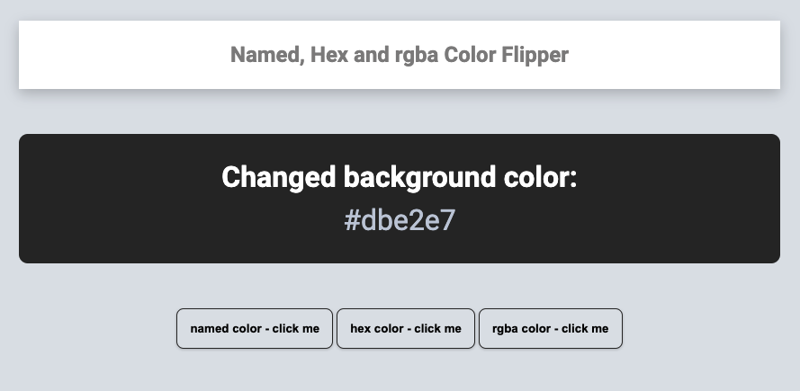
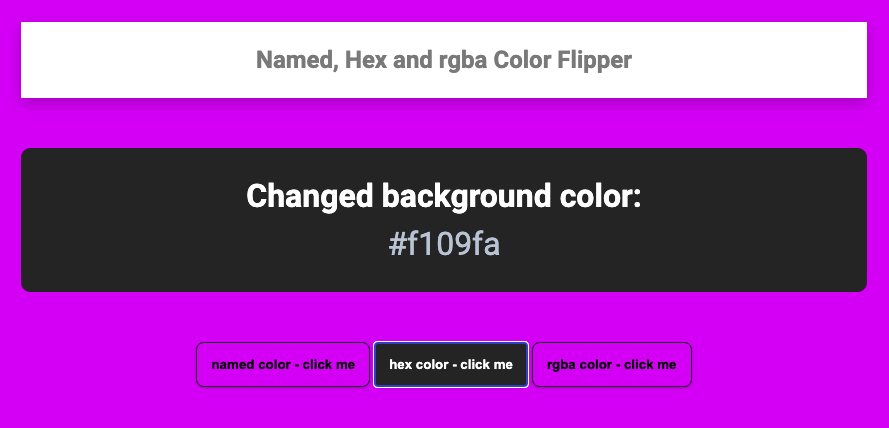
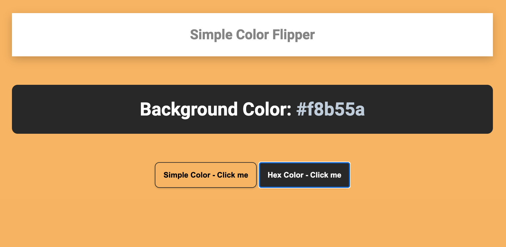

# Simple Color Flipper

## What is this about?

A simple color flipper that has two flippable color options to chose from:

- simple colors
- hex colors

### Sources

- starting point was this [FreeCodecamp article - 40 JavaScript courses for Beginners](https://www.freecodecamp.org/news/javascript-projects-for-beginners/)
- [the color flipper part on FreeCodecamp](https://www.freecodecamp.org/news/javascript-projects-for-beginners/#how-to-create-a-color-flipper)

Author of this is John Smilga

- [YouTube video color flipper](https://www.youtube.com/watch?v=3PHXvlpOkf4&t=421s)
- [overview of the JavaScript projects, John Smilga created](https://www.vanillajavascriptprojects.com/)
- [John Smilga's color flipper on GitHub](https://github.com/john-smilga/javascript-basic-projects/tree/master/01-color-flipper)

- [an additional source how to calculate hex colors](https://codepen.io/iamsaief/pen/NWxQMjW)

### Visuals - what you get with this code

<!-- 480px

640px
 -->

### Tech

- simple HTML, CSS, JavaScript, no build process

### How to run this?

- clone the repo
- cd into project
- open `index.html` in your browser of choice
