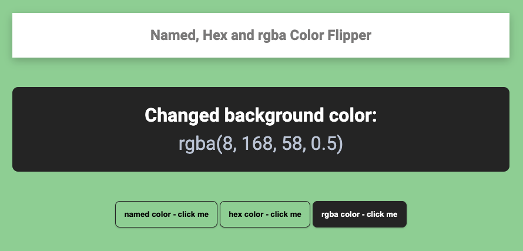

# Named Color, Hex Color and rgba Color Flipper

## What is this about?

A named color, hex color and rgba color flipper that has 3 flippable color options to chose from:

- named colors
- hex colors
- rgba colors

### Sources

- Starting point: [FreeCodecamp article - 40 JavaScript courses for Beginners](https://www.freecodecamp.org/news/javascript-projects-for-beginners/)
- See this link for [the color flipper part in that article](https://www.freecodecamp.org/news/javascript-projects-for-beginners/#how-to-create-a-color-flipper)

Author/Creator of that color flipper is John Smilga

- [YouTube video color flipper](https://www.youtube.com/watch?v=3PHXvlpOkf4&t=421s)
- [John Smilga's color flipper on GitHub](https://github.com/john-smilga/javascript-basic-projects/tree/master/01-color-flipper)
- [Overview of the JavaScript projects, John Smilga created](https://www.vanillajavascriptprojects.com/)
- [An additional source how to calculate hex colors](https://codepen.io/iamsaief/pen/NWxQMjW)

### Visuals - what you get with this code

### Tech

- simple HTML, CSS, JavaScript, no build process

### How to run this?

- clone the repo
- cd into project
- open `index.html` in your browser of choice
